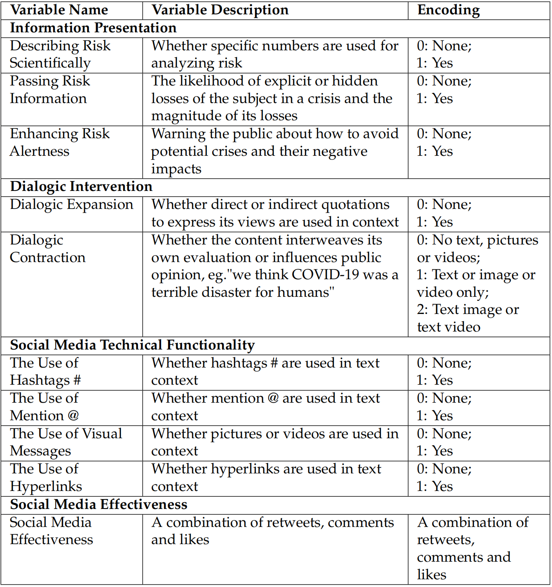

# Facebook COVID-19 Risk Communication Database

This is the database for the article:  
**"How Facebook mediated COVID-19 Risk Communication: Evidence from Chinese External Media During the Winter Olympics."**

## 📁 Dataset Files

The database folder contains three key files:

---

### 1. `1_fb_crawlers_all.csv`

This file contains 15,931 Facebook posts published by **nine official Chinese external media outlets** between **January 21 and February 25, 2022**.

- **Data sources**: 9 verified public pages:
  1. CGTN  
  2. China Daily  
  3. China Xinhua News  
  4. People’s Daily, China  
  5. CCTV  
  6. CCTV 中文  
  7. China News  
  8. 中国新闻社  
  9. Global Times

- **ID** column: Sequential numeric identifier for each post (1 to 15,931) 

- **AUTHOR_ID** column: Numeric ID (1–9) representing the media source listed above.

- **LINK** column: The URL link to the original Facebook post.

- **CONTENT** column: The textual content of the post.

- **LIKE** column: Number of likes collected on **July 30, 2022**

- **Share** column: Number of shares collected on **July 30, 2022** 

- **Comment** column: Number of comments collected on **July 30, 2022**

- **Time** column: The original **post publishing time** (in timestamp format)

#### 🔍 Data Collection Method

- Posts were retrieved using the **CrowdTangle API**, an official data tool provided by Facebook (Meta) for accessing public content from verified pages (which was unfortunately shut down on **August 14, 2024**).
- API access was obtained through the official CrowdTangle application process, and all data collection complied with Facebook’s [CrowdTangle Terms of Service](https://www.crowdtangle.com/terms/).
- The official API documentation and sample code were available via the GitHub repository: [https://github.com/CrowdTangle/API](https://github.com/CrowdTangle/API)
- We adopted the following collection strategy:
  - Each API call requested **50 posts**, which is within the API’s per-request limit (maximum 100).
  - Calls were made at a fixed interval of **one request per minute**, resulting in a collection rate of approximately **3,000 posts per hour**.
  - The full dataset of **15,931 posts** was collected **about 5 hours**.

---

### 2. `2_fb_content_filter.xlsx`

This file is a **filtered subset** of `1_fb_crawlers_all.csv`, including only relevant COVID-19–related posts.  
The filtering process includes:

- Posts must contain keyword **"COVID"**
- Posts **must not contain non-English characters**
- The post must have been published between **January 28 and February 20, 2022** (one week before the 2022 Winter Olympics to the end date)
- Each content item was **manually reviewed and cleaned** to ensure text completeness and accuracy

---

### 3. `3_fc_encoding.xlsx`

This file contains **rule-based encodings** of the filtered posts from `2_fb_content_filter.xlsx`, based on a framework of factors influencing communication effectiveness. Each post is annotated across multiple dimensions, including:

#### ✅ **Information Presentation**
- Describing Risk Scientifically
- Passing Risk Information
- Enhancing Risk Alertness

#### ✅ **Dialogic Intervention**
- Dialogic Expansion
- Dialogic Contraction

#### ✅ **Social Media Technical Functionality**
- Use of hashtags (#)
- Use of mentions (@)
- Use of Visual Messages
- Use of hyperlinks

#### ✅ **Social Media Effectiveness**
- Engagement metrics (likes, comments, shares)

Each variable is encoded using a **binary or categorical scheme**, following the table below:

---

## 📄 Citation

If you use this dataset, please cite:

> *How Facebook mediated COVID-19 Risk Communication: Evidence from Chinese External Media During the Winter Olympics* (https://www.preprints.org/manuscript/202503.0046)

---